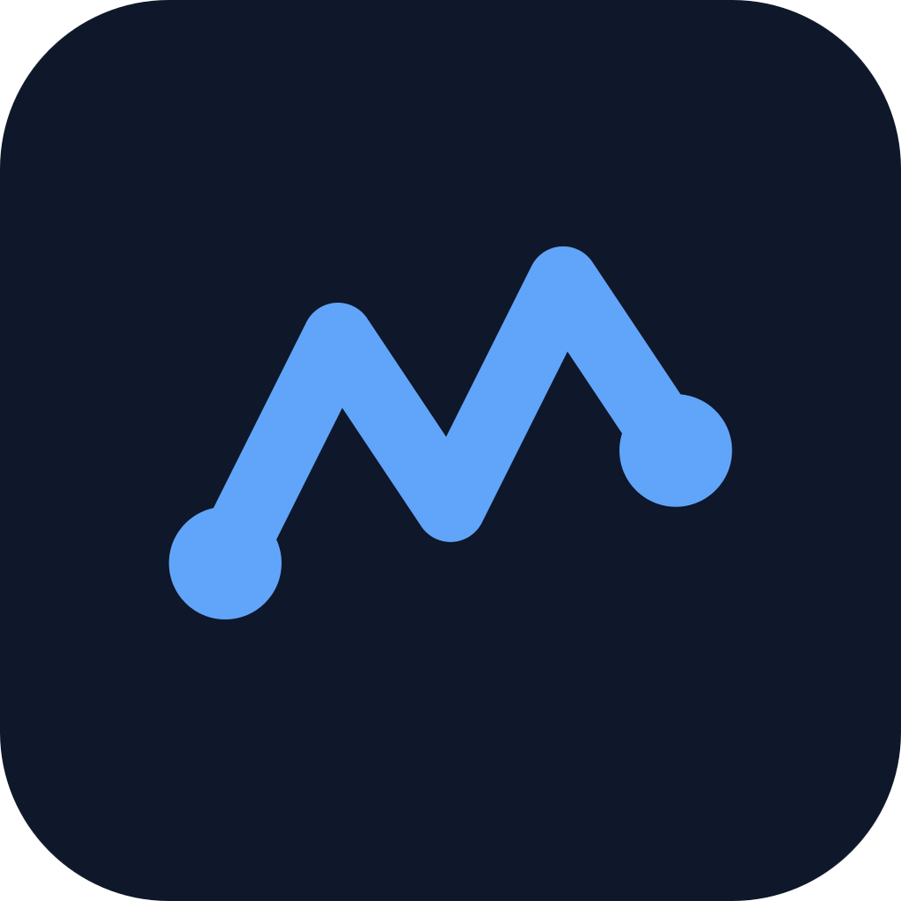
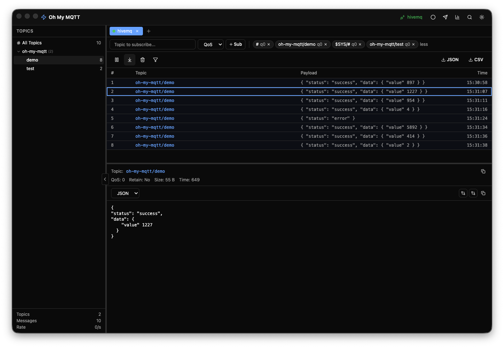

<p align="center">
  
</p>

# Oh My MQTT

A modern, high-performance MQTT client for desktop and web. Monitor topics in real time, record message sessions, and export everything as JSON — across multiple simultaneous connections.

Built as a faster, more capable alternative to MQTT Explorer.

<p align="center">
  
</p>

## Key Features

- **Multi-Connection Tabs** — Connect to multiple MQTT brokers at once, each in its own tab
- **Connection Import / Export** — Save and share connection profiles as JSON
- **Message Download** — Export received messages as JSON for analysis or archiving
- **Session Recording** — Capture all messages within a time window and download them as JSON
- **Topic Tree Browser** — Visualize your MQTT topic hierarchy in real time
- **Message Viewer** — Inspect payloads in JSON, Plain Text, HEX, or Base64
- **Publish Messages** — Send messages with QoS and Retain options
- **Advanced Search** — Filter by regex, topic pattern, or time range
- **Statistics Dashboard** — View message rates, per-topic stats, and QoS distribution
- **Multi-Protocol Support** — `mqtt://`, `mqtts://`, `ws://`, `wss://`

## Installation

### Docker (Recommended for macOS)

The Docker version runs in your browser and requires no code signing. All protocols including `mqtt://` and `mqtts://` are fully supported through a built-in WebSocket-to-TCP proxy. Multi-architecture images are available for both Apple Silicon (arm64) and Intel (amd64).

```bash
docker run -d -p 3000:3000 chapsaldduk/oh-my-mqtt
```

Then open [http://localhost:3000](http://localhost:3000).

Or using Docker Compose:

```bash
curl -O https://raw.githubusercontent.com/chapsaldduk/oh-my-mqtt/main/docker-compose.yml
docker compose up -d
```

### Windows / Linux

Download the latest installer from [GitHub Releases](https://github.com/chapsaldduk/oh-my-mqtt/releases).

| Platform | File                 |
| -------- | -------------------- |
| Windows  | `.exe`               |
| Linux    | `.AppImage` / `.deb` |

### macOS (Homebrew)

> **Note**: The macOS desktop app is not code-signed. Direct `.dmg` downloads will be blocked by Gatekeeper. Use Homebrew or Docker instead.

```bash
brew tap chapsaldduk/oh-my-mqtt
brew install --cask --no-quarantine oh-my-mqtt
```

## Platform Comparison

|                      | Docker               | Desktop (Electron)                  |
| -------------------- | -------------------- | ----------------------------------- |
| **Protocols**        | mqtt, mqtts, ws, wss | mqtt, mqtts, ws, wss                |
| **macOS Gatekeeper** | No issues            | Requires Homebrew `--no-quarantine` |
| **Installation**     | `docker run`         | Installer or Homebrew               |
| **TLS Certificates** | Not supported        | Supported                           |
| **Auto-Update**      | Pull latest image    | Built-in updater                    |

## Tech Stack

| Component   | Technology                  |
| ----------- | --------------------------- |
| Frontend    | React 19 + TypeScript       |
| Build Tool  | electron-vite (Vite)        |
| Bundler     | electron-builder            |
| State       | Zustand                     |
| MQTT Client | mqtt.js                     |
| Database    | IndexedDB (Dexie.js)        |
| UI          | shadcn/ui + Tailwind CSS v4 |
| Testing     | Vitest + Testing Library    |

## Contributing

Contributions are welcome. Please open an issue first to discuss what you would like to change.

## License

MIT
